## Основные характеристики топика:

1. Партиции

- Значение: 8 партиций.  
  Каждая партиция — независимый лог, который может обрабатываться своим брокером и своим инстансом консюмера, поэтому нагрузка распределяется и чтение/запись могут идти параллельно.  
- Зачем нужно:  
  - Увеличить пропускную способность топика за счет параллельной обработки.  
  - Масштабировать консюмеры по числу партиций (макс 8 активных инстансов консюмерв).  
- Что будет при 1 партиции:  
  - Все сообщения пишутся и читаются через один лог -> образуется bottleneck.  
  - В каждый момент времени работать с топиком может только один инстанс консюмера.  
  - Под пиками нагрузки время обработки увеличивается.

2. Репликация (Replication Factor = 3)

- Значение: каждая партиция хранится в трех копиях на разных брокерах: один лидер + два фолловера.  
- Зачем нужно:  
  - Обеспечить сохранность данных при выходе из строя брокера.  
  - Сохранить возможность читать и писать в топик даже при сбое части кластера.  
- Практический эффект:  
  - При отказе одного брокера лидер переизбирается на одной из реплик, работа продолжается.  

3. Список синхронных реплик (ISR = 24 of 24)

- ISR (In‑Sync Replicas) — набор реплик партиции, которые полностью догнаны до лидера и могут участвовать в кворуме записи и в выборах нового лидера. Только реплики из ISR могут стать лидером, что гарантирует, что новый лидер всегда содержит самые свежие подтвержденные данные.
- Значение: для всех 8 партиций все 3 реплики считаются синхронизированными с лидером, всего 24 синхронных реплики из 24 возможных.  
- Зачем нужно:  
  - Показатель здоровья репликации: все брокеры успевают принимать данные и подтверждать записи.  
  - Гарантирует, что при переключении лидера есть полные, актуальные копии.  
- Что если часть реплик выпадет из ISR:  
  - Топик формально доступен, но запас по отказоустойчивости уменьшается.  

4. Политика очистки (Clean Up Policy = DELETE)

- Значение: старые сегменты лога физически удаляются при превышении лимита по размеру или возрасту (параметры retention.bytes и retention.ms соответственно).  
- Зачем нужно:  
  - Не допустить бесконечного роста топика и заполнения диска.  
  - Оставлять в топике только «актуальное окно» данных, достаточное для бизнес‑логики и аналитики.  
- Последствия:  
  - Старые сообщения полностью исчезают, поэтому топик не подходит как долговременное хранилище -> необходимо грамотно выбирать указанные выше параметры, чтобы консюмеры успевали корректно обрабатывать лог.

5. Сегменты (Segment Size = 3 GB, Segment Count = 24)

- Значение: данные каждой партиции разбиваются на файлы‑сегменты по 3 ГБ; сейчас у топика 24 сегмента.  
- Зачем нужно:  
  - Упрощает управление хранением: удаляется целый сегмент, а не отдельные записи.  
  - Снижает фрагментацию и улучшает работу файловой системы и дискового кэша.  
- Практический эффект:  
  - Ускоряется удаление старых данных по retention.
  - Баланс между слишком маленькими файлами и слишком большими - аналог того, как происходит работа с диском в Linux: идет обращение к сегментам диска, а не к единичным байтам.

6. Вывод:  

- Топик настроен достаточно отказоустойчиво для работы с реальной нагрузкой.  

## Проведение НТ

В результате проведения НТ получим следующие результаты:

В ходе НТ было отправлено 1000000 сообщений с итоговой скоростью примерно 184468 сообщений в секунду (~176 МБ/с). Средняя задержка записи составила 147 мс, максимальная — 388 мс; медиана — 147 мс, 95‑й перцентиль — 260 мс, 99‑й — 362 мс, 99.9‑й — 381 мс. Это означает, что почти все записи укладываются в 300–400 мс.

Убедимся, что все брокеры содержат события:
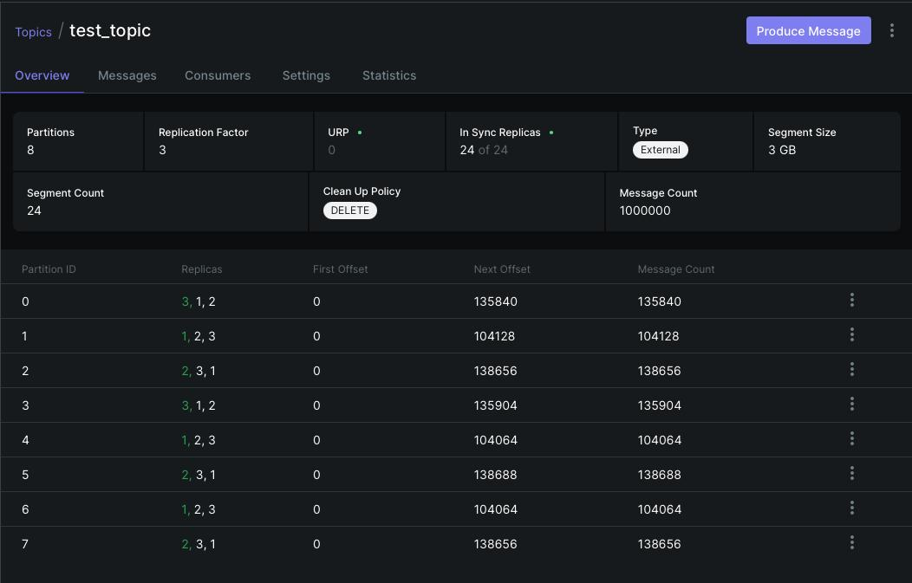

Наша система благополучно пережила нагрузочное тестирование без отказа отдельных узлов.

## Проверка отказоустойчивости

### Начало работы

Состояние кластера в начальный момент времени:
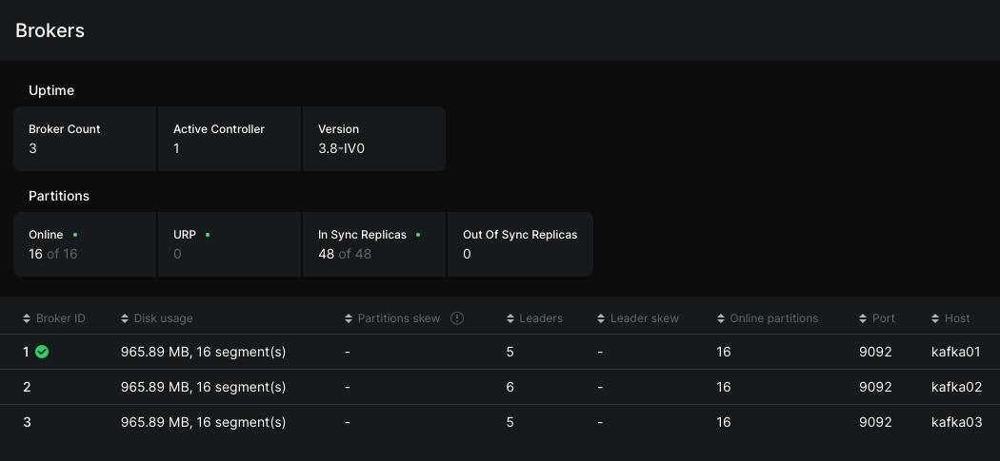
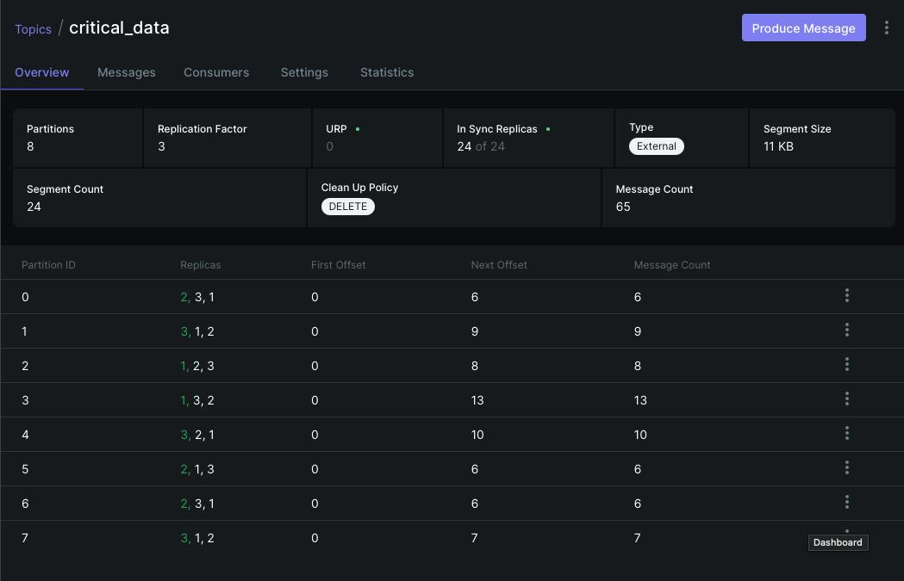

Запускаем скрипт, который моделирует реальные записи в Kafka:
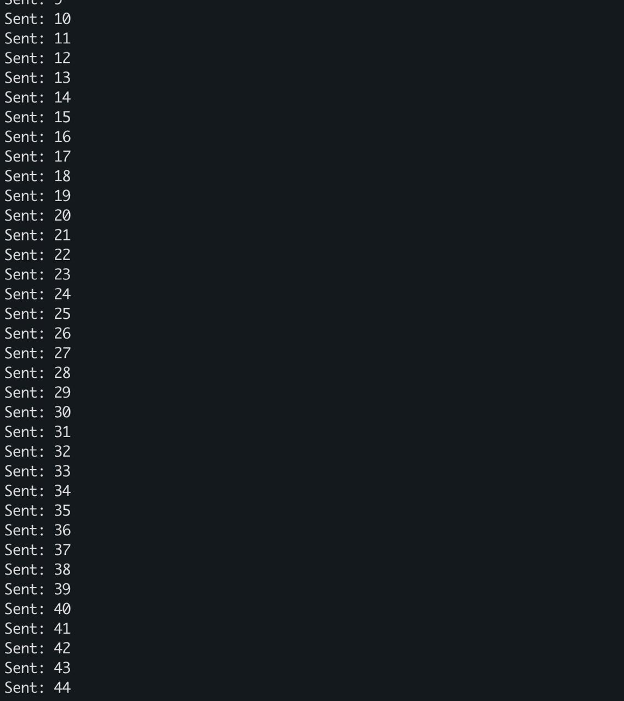

### Отключение первого узла

Отключаем узел, который является лидером в данный момент времени. В кластере осталось 2 работающих узла.
Проверим состояние кластера:
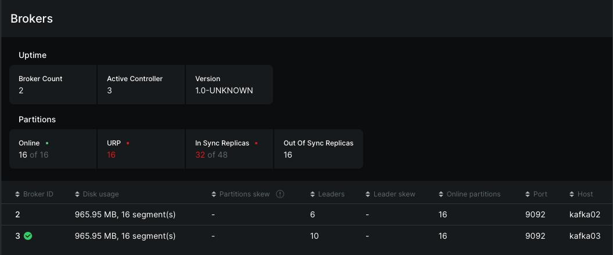
На рисунке видно, что сейчас в кластере доступно два узла, при этом новым лидером стала 3 нода.

Рассмотрим состояние топика. У партиций также сменился лидер, а общее число IRS уменьшилось с 3 до 2 на партицию (что является ожидаемым). При этом топик продолжает принимать записи, т.к параметр `min.insync.replicas` равен 2 (можно узнать из логов узлов).
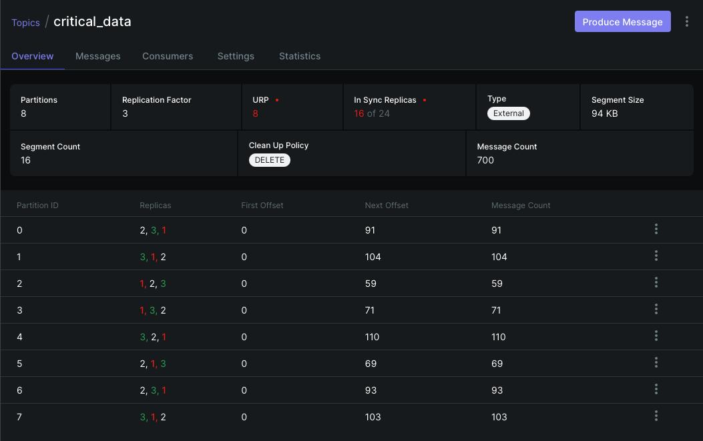

При этом в логах скрипта видно, что некоторые данные были отброшены по таймауту, однако после выбора нового лидера записи стали проходить без проблем.
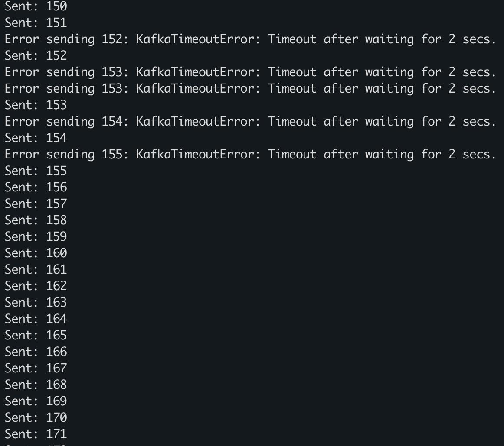

### Отключение второго узла

Отключаем узел, который является лидером в данный момент времени. В кластере остался 1 работающий узел.
Проверим состояние нашего топика:

Как мы видим, информация о топике просто не прогружается. Однако мы можем сами понять, что количество IRS стало равным 1 на партицию, что меньше параметра `min.insync.replicas` - количество синхронных реплик меньше требуемого количества. Kafka должна была остановить запись в топик, однако как видно из рисунка ниже, некоторые данные получается записать (возможно это происходит в те моменты, когда запущенный узел пытается связаться с выключенными для выбора нового лидера, и именно тогда в него проходят некоторые записи).
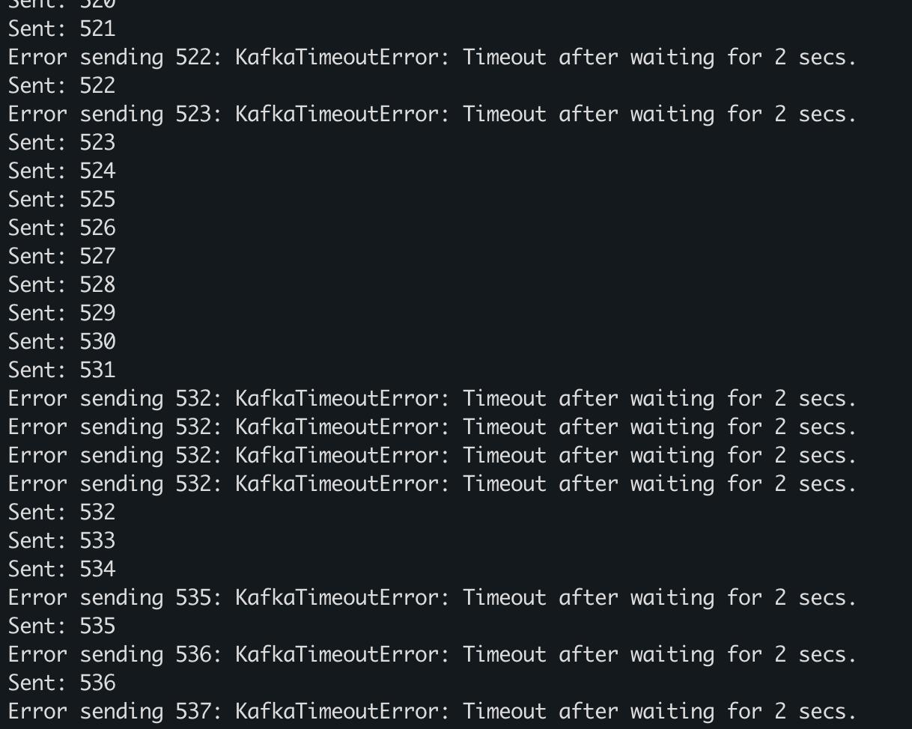

Проверим логи единственного запущенного узла. В них видно, что он пытается связаться с выключенными нодами и, не получим ответа, прекращает выборы нового лидера, поскольку не удается установить кворум.
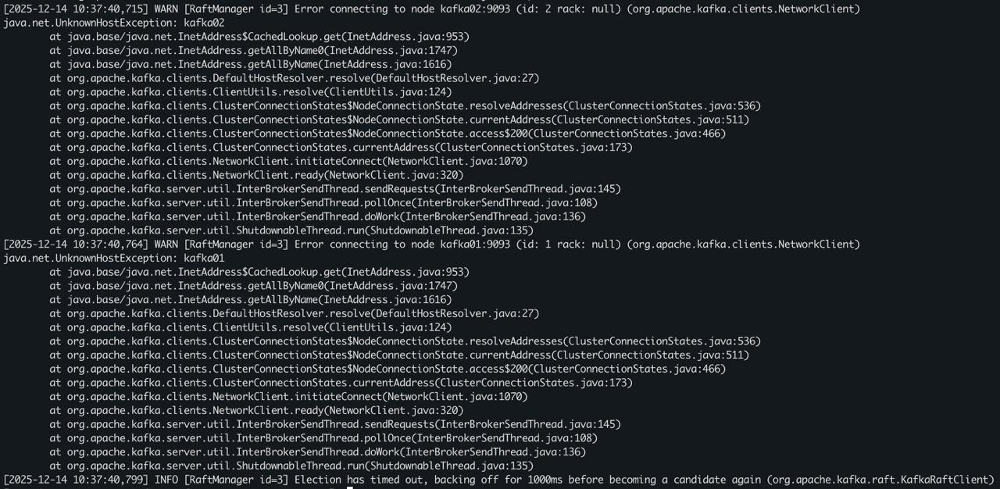

### Включение второго узла

Включим один из узлов, чтобы общее количество запущенных нод было равно 2.
Проверим состояние кластера:
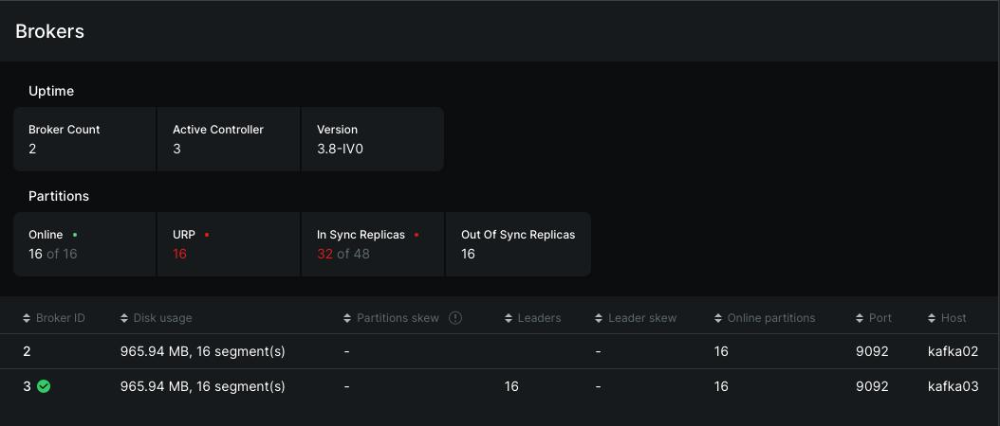
Как мы видим, удалост установить кворум и третий узел был выбран в качестве лидера.

Проверим состояние нашего топика:

Мы видим, что количество IRS стало равным 2 на партицию - одна копия хранится на лидере, другая на реплике. Это значение равно `min.insync.replicas`, следовательно, наш кластер может нормально функционировать и записывать данные в топики. При этом все данные с топика на лидере были отреплицированы на реплику. 

Из логов скрипта видно, что запись в топик начала происходить без таймаутов.
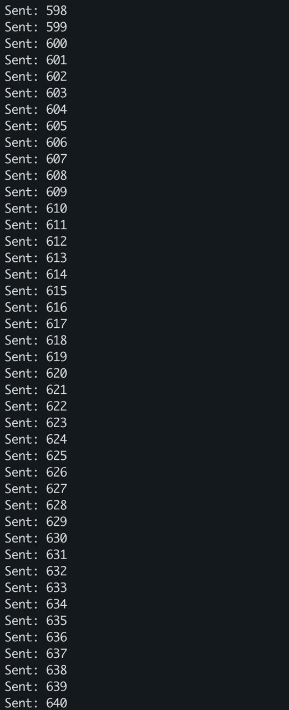

### Вывод

В результате проверки отказоустойчивости мы увидели, что для нормального функционирования кластера необходимо наличие кворума, чтобы был выбран узел лидер, с которого будет происходить репликация на другие узла. При 3-нодовой конфигурации максимально может выйти из строя 1 узел. 