## Запуск и проверка состояния

Запустим данный проект
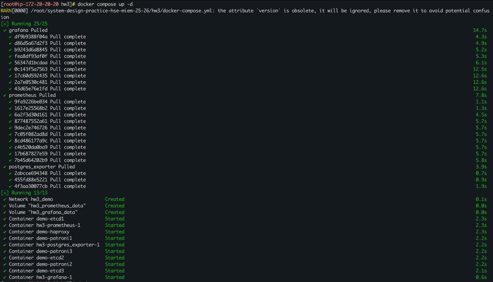

Проверим состояние кластера patroni
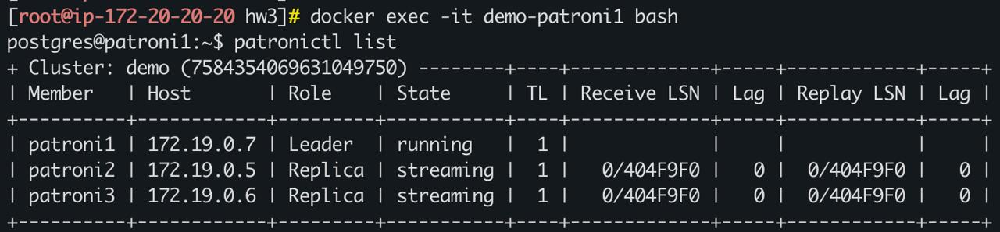
На данном рисунке видно, что у нас первый узел является лидером, остальные два - реплики. Все узлы запущены, реплики успешно получают записи с лидера и не отстают от него.

Проверим состояние HAProxy
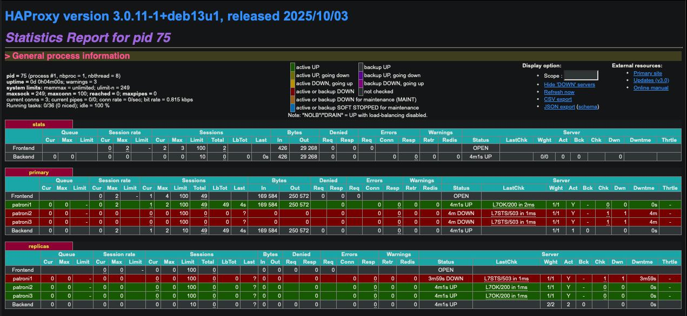
В блоке "primary" активным является первый узел - он действительно в данный момент выступает в качестве лидера. В блоке "replicas" активными являются другие два узла, они выступают в качестве реплик. В столбце "Open" мы можем увидеть, сколько по времени соответствующие узлы занимают определенные им роли. При этом мы видим, что данные отправляются только лидеру - на реплики все изменения попадают в результате работы репликации.

Создадим нужные нам таблицы в БД postgres
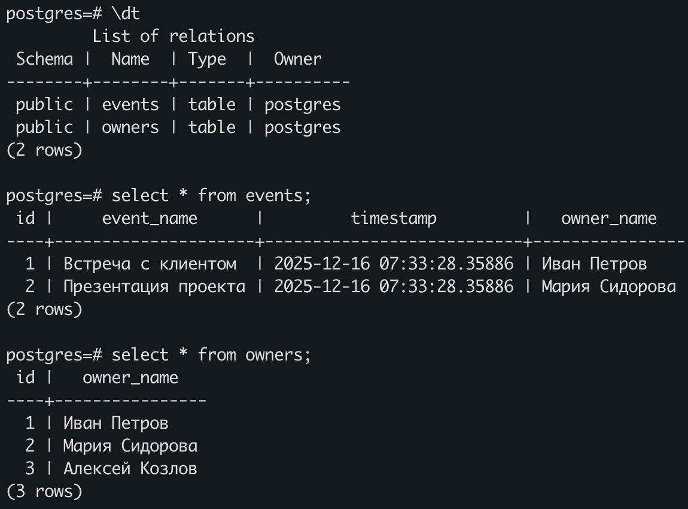

Запустим скрипт, моделирующий работу с нашем кластером
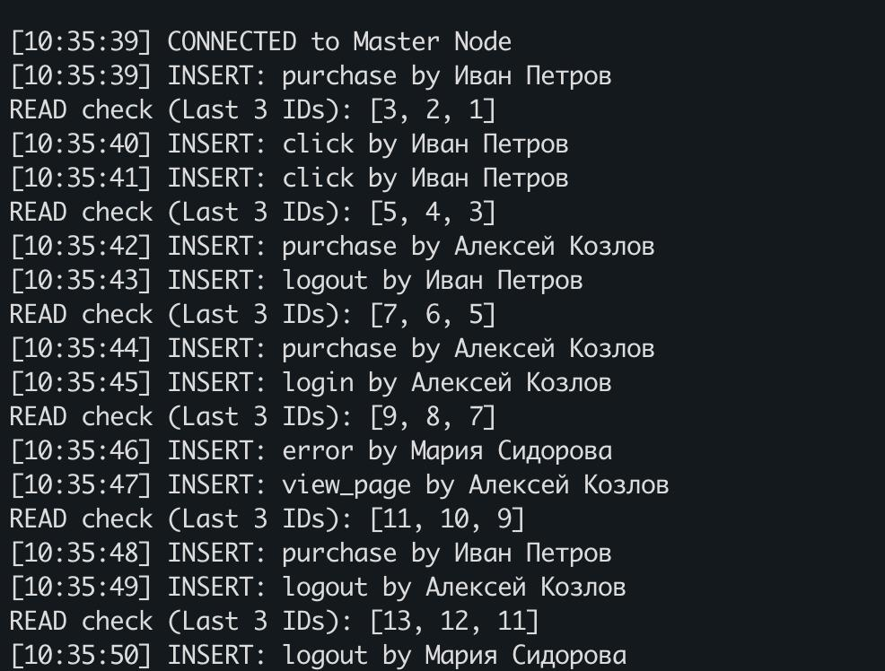

## Отключение узлов patroni

Остановим узел patroni1, который является лидером.
Проверим состояние кластера patroni
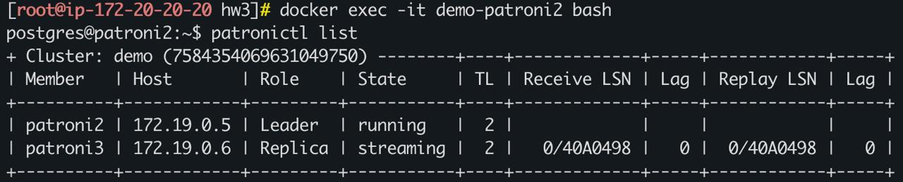
Мы видим, что в кластере доступно 2 узла, новым лидером стал patroni2.

Проверим состояние HAProxy
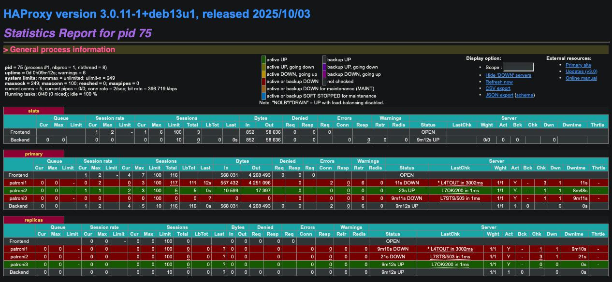
Мы видим, что в блоке "primary" активным стал второй узел, При этом в блоке "replicas" активным остался только третий узел, следовательно, у нас осталась только 1 реплика.

В логах скрипта наблюдалось следующее поведение - при отключении лидера существующие соединения были оборваны. После того, как был выбран новый лидер, подключение было восстановлено, и скрипт успешно продолжил свою работу.
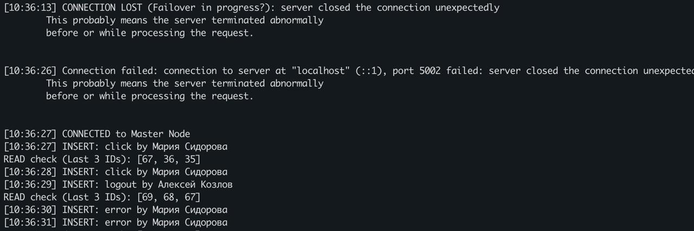

Включим обратно первый узел. После запуска он стал репликой и "нагнал" лидера, добавив к себе все изменения.
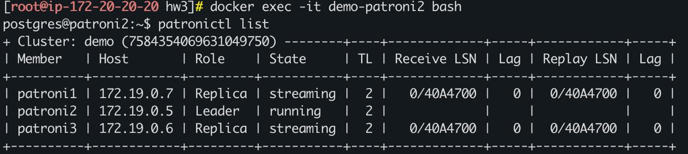

Остановим опять узел patroni1, который в данный момент является репликой.
Проверим состояние кластера patroni
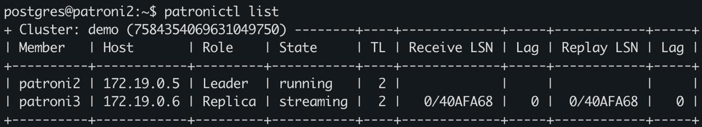
Как мы видим, ничего не изменилось, новый лидер не переизбирался, просто стала недоступна одна из реплик.

Посмотрим логи скрипта - подключение не было оборвано, поскольку лидер не изменился, а клиент не пишет данные напрямую в реплику.
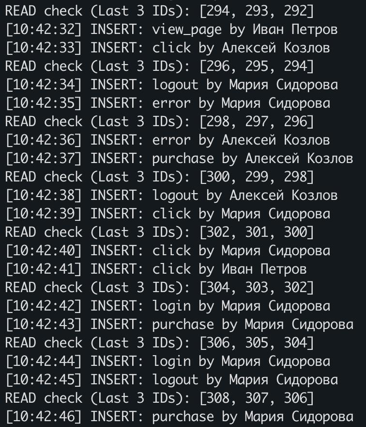

## Отключение узлов etcd

При остановке одного узла etcd мы не заметим никаких изменений, поскольку кворум не нарушится. Чтобы увидеть какие-то изменения с кластером patroni, отключим сразу два узла etcd, нарушив тем самым кворум в 3-нодовом кластере.

Проверим состояние HAProxy (проверить состояние patroni не получится, поскольку не получается подключиться к etcd)
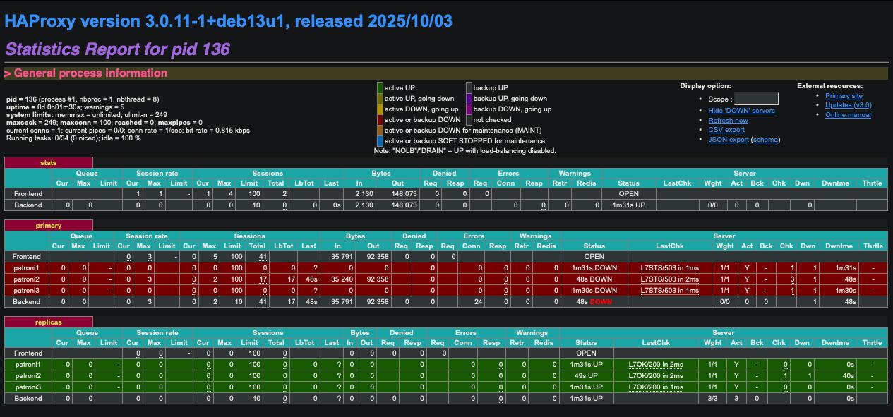
На данном рисунке видно, что все узлы перешли в состояние реплик - кластер перешел в read-only состояние, новые данные записать в него не получится.

В логах скрипта наблюдаем следующее - к базе не удается подключится, поскольку соединение является read-only.
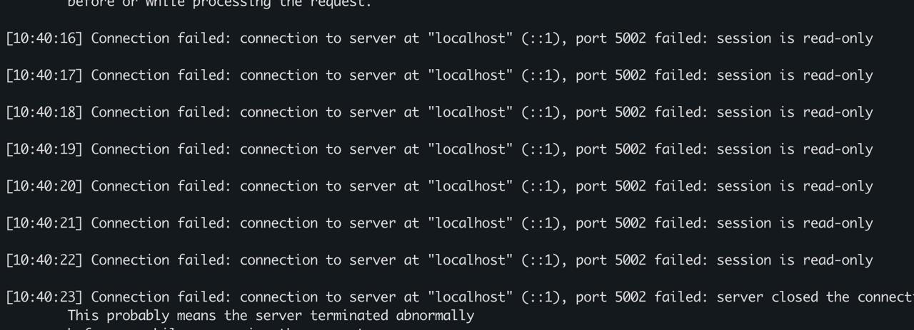

Включим обратно остановленные раннее узлы etcd. Кворум должен восстановиться, и кластер patroni должен снова стать доступным.
Проверим состояние кластера patroni
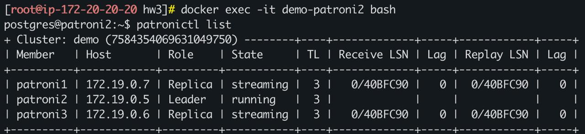
На рисунке видно, что в кластере снова стали доступны лидер и две реплики. Следовательно, кластер снова готов к работе!

Проверим состояние HAProxy
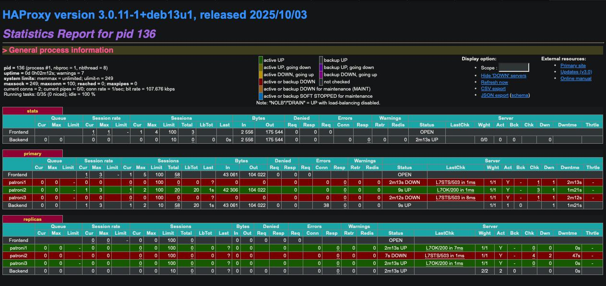
Состояние HAProxy также подтверждает, что кластер снова доступен.

Проверим логи скрипта - все операции проходят успешно.
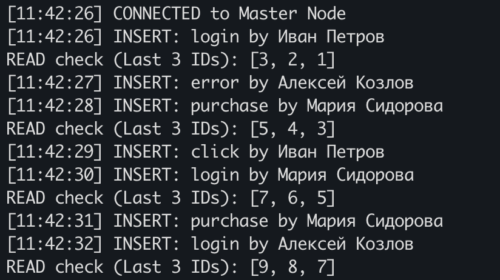

## Отключение HAProxy

В данной архитектуре балансировщик выступает в качестве "bottleneck" - если "упадет" данный компонент, то кластер перестанет быть доступным. Приложения просто не смогут подключиться к кластеру, при этом сам кластер будет продолжать функционировать.

Остановим HAProxy.
Проверим состояние кластера patroni
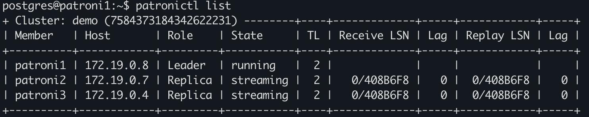
На рисунке видно, что кластер нормально функционирует, все узлы запущены и выполняют свои функции.

При этом в логах скрипта видно, что подключиться до кластера не получается.
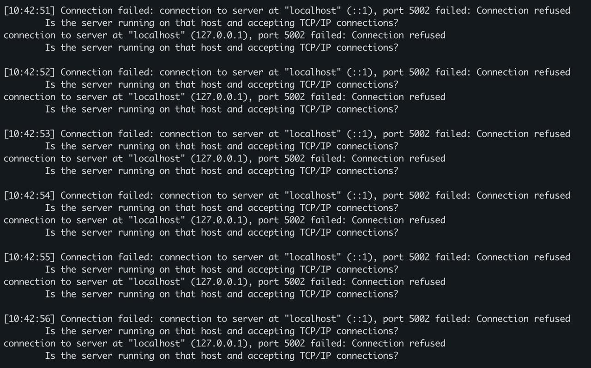

Как можно решить исправить текущую архитектуру, чтобы балансировщие перестал быть единой точкой отказа:
- развернуть кластер HAProxy при помощи keepalived: если один узел упадет, то виртуальные адрес переедет на другой узел;
- использовать IP anycast - подход, при котором один и тот же адресс анонсируется через BGP с нескольких узлов, и маршрутизаторы ведут клиента к ближайшей реплике (https://procloud.ru/blog/technologies/anycast/).